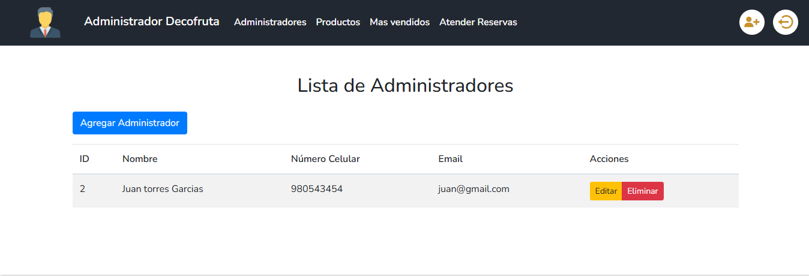
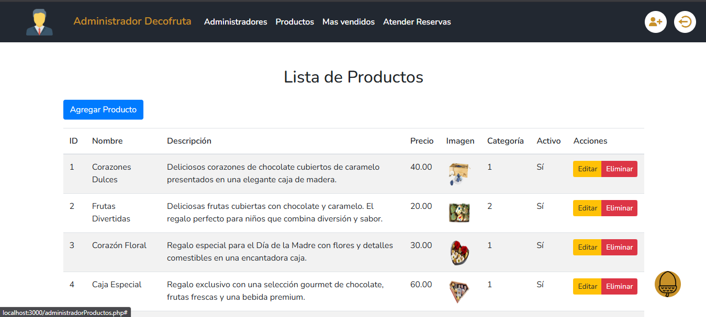
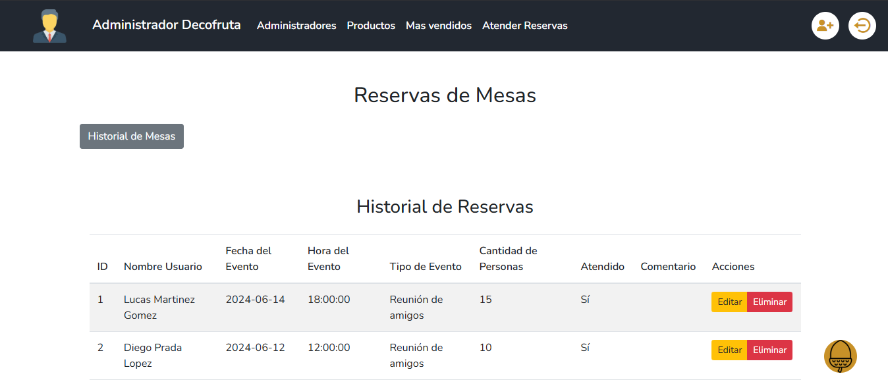
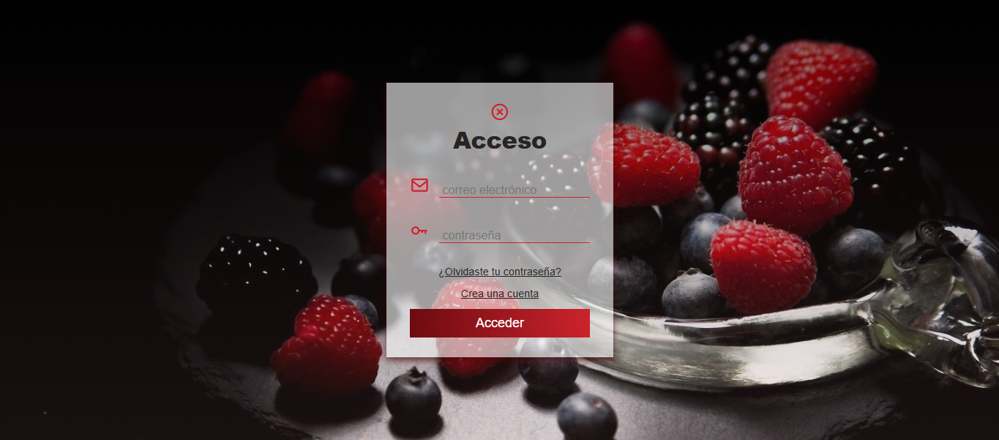
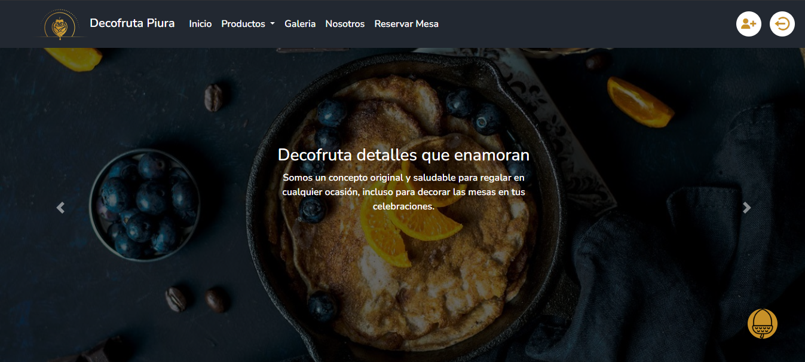
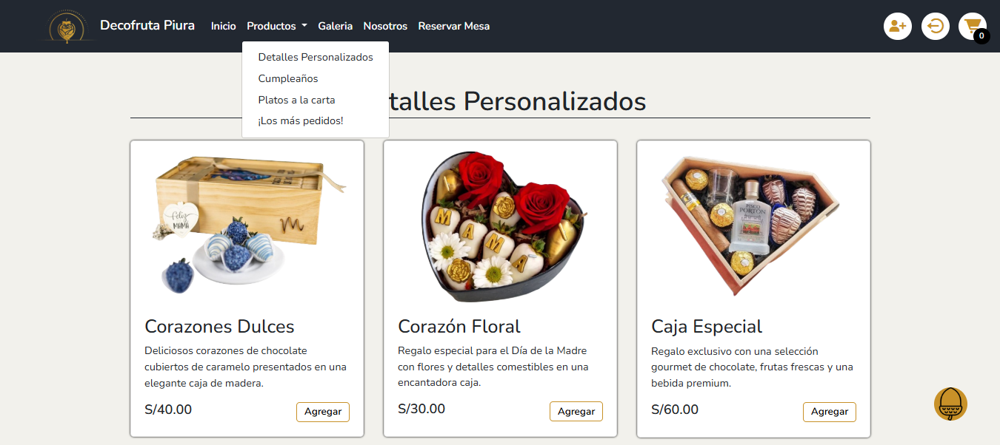
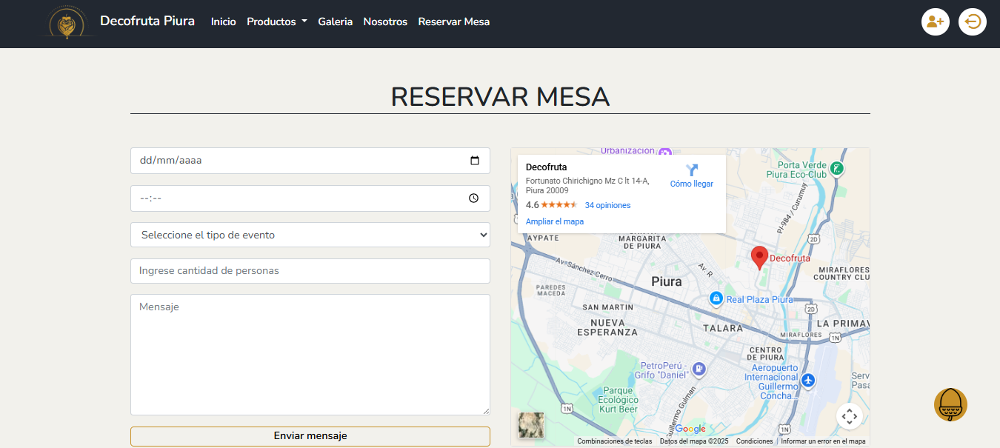

# 🍓 DecoFruta — Plataforma Web de Venta y Reservas

**DecoFruta** es una aplicación web diseñada para ofrecer productos comestibles a base de frutas para diferentes ocasiones.
Permite a los usuarios **realizar pedidos, reservar mesas, consultar productos** y conocer más sobre la marca.  
Cuenta además con un **módulo administrativo** para la gestión de productos, reservas, ventas y usuarios.

---

## 🚀 Tecnologías Utilizadas

- **Frontend:** HTML5, CSS3, Bootstrap, JavaScript  
- **Backend:** PHP (programación estructurada)  
- **Base de Datos:** MySQL  
- **Control de Dependencias:** Composer  
- **Control de Versiones:** Git y GitHub  

---

## ⚙️ Funcionalidades Principales

### 👨‍💻 Módulo Administrador
- Gestión de productos (alta, baja, modificación)
- Control de reservas de mesas
- Registro de ventas y reportes
- Administración de usuarios

📸 **Vista del Panel de Administración:**

📸 **Vista del Panel de Administración Productos:**

📸 **Vista del Panel de Administración Productos:**

📸 **Vista del Panel de Administración Reservas:**

### 🍎 Módulo Cliente
- Visualización de productos por categoría y ocasión
- Reserva de mesas para eventos
- Registro e inicio de sesión
- Carrito de compras y simulación de pedidos

📸 **Vista Acceso:**

📸 **Vista Inicio:**

📸 **Vista del Catálogo de Productos:**

📸 **Vista del Carrito de Compras:**

📸 **Vista de Reserva de Mesas:**

---

## 💡 Nota

> Este repositorio refleja el proceso de aprendizaje y evolución durante el desarrollo del curso.  
> Aunque la estructura no sea definitiva, evidencia el progreso técnico y las buenas prácticas adquiridas en el desarrollo web.

